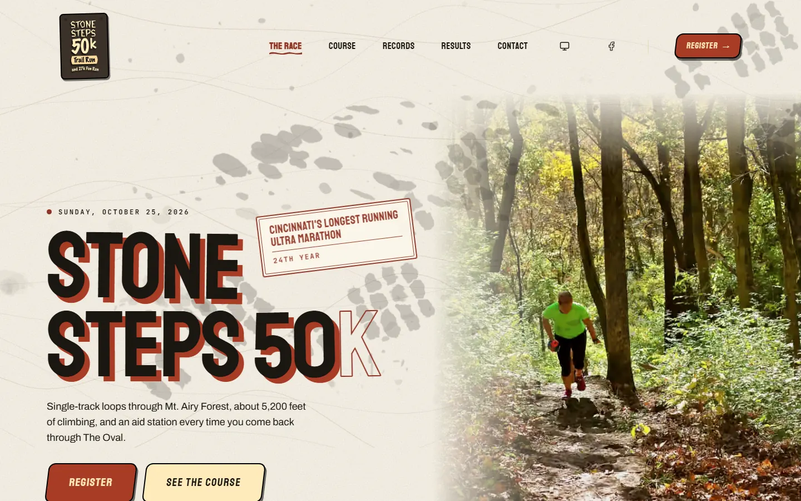
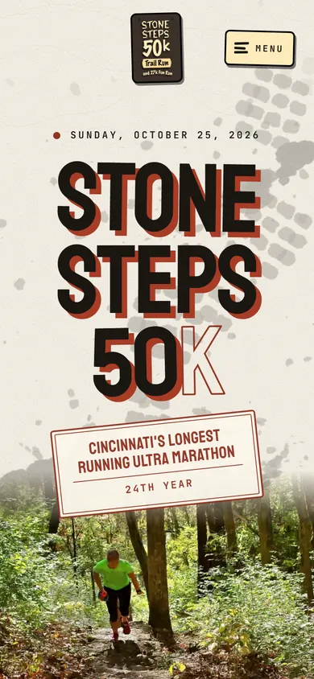
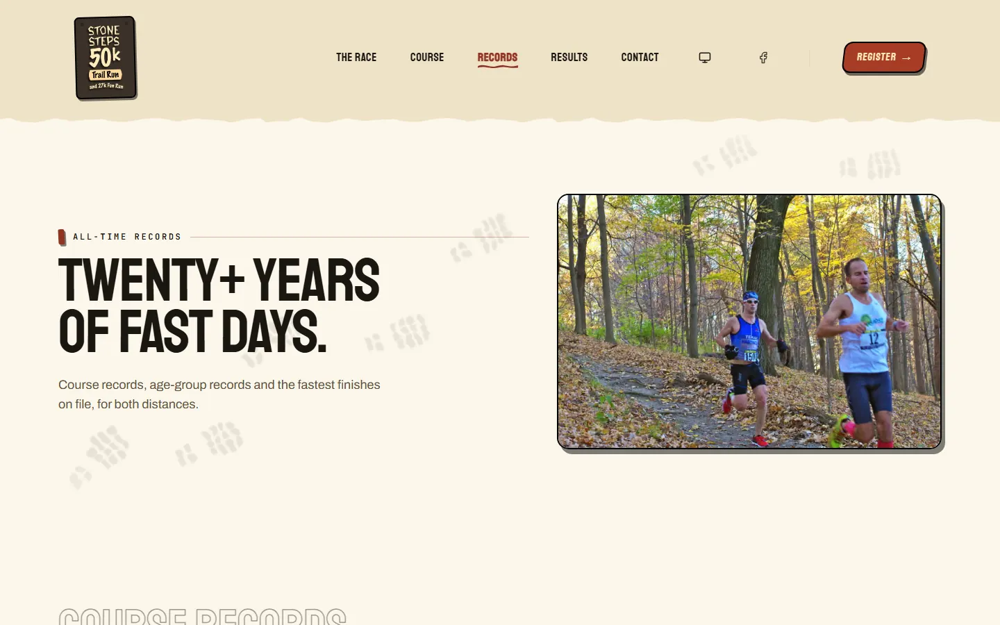

<div align="center">

# Stone Steps 50K

**The website for Cincinnati's longest running ultra marathon, rebuilt from WordPress into a fast, editor-friendly Astro + Sanity site on Cloudflare Workers.**

[](https://github.com/NateJ45/stonesteps-50k/actions/workflows/ci.yml)
[](https://stonesteps50k.com)


[Live site](https://stonesteps50k.com) | [Built by Nixon Creative Studio](https://nixoncreativestudio.com)




</div>

## What it is

[stonesteps50k.com](https://stonesteps50k.com) is the public site for the Stone Steps 50K and 27K, run in Mt. Airy Forest, Cincinnati. It replaced a WordPress site. Its job is to get a runner to the right registration page, answer the practical questions plainly, and carry the race's history. Registration and timing stay on RunSignUp; this site pulls the results back in so the archive keeps itself current.

## Highlights

- **Results archive, 2003 to 2025.** Recovered from the Wayback Machine and RunSignUp, with a page per year, per-runner history pages and a records page.
- **Hands-off results.** A nightly GitHub Actions workflow imports new results from RunSignUp into Sanity and bakes race-day weather, so nobody has to remember a yearly chore.
- **Edit on the page.** Sanity Studio is embedded at `/studio` with live draft preview and click-to-edit, so the race director can change copy without touching code.
- **Contact form without a third party.** Cloudflare Email Sending plus a D1 database that stores every submission before any email is attempted.
- **Backups.** Daily encrypted Sanity exports to a GitHub artifact and to Cloudflare R2.
- **Gated releases.** `main` is protected: a PR plus green CI (type check, lint, format, unit tests, link check, Playwright accessibility and reflow suites on Chromium and a WebKit iPhone profile) before anything deploys. Lighthouse and visual-regression workflows run alongside.
- **Light and dark themes**, a hand-made trail look, and an accessibility score gated at 100.

## Stack

Astro 7 (static output, a few SSR routes) and TypeScript strict, Sanity v6, Tailwind 4, React 19 islands, Cloudflare Workers (with D1, Email Sending and R2), Playwright, Lighthouse CI, GitHub Actions.

## More screenshots



## Developing

Everything below is the working documentation for the codebase, inherited from the starter this site was forked from. Start with [`CLAUDE.md`](./CLAUDE.md) for the rules and [`OPERATIONS.md`](./OPERATIONS.md) for the playbook. Open work is tracked in [`docs/PENDING.md`](docs/PENDING.md). Security reports: see [`SECURITY.md`](./SECURITY.md).

## The starter underneath

This site is a fork of a reusable, production-grade starter for small-business marketing sites on **Astro + Sanity + Cloudflare Workers**, by [Nixon Creative Studio](https://nixoncreativestudio.com). It is the foundation the studio's client sites are built on, so a polished, editor-friendly site is an afternoon of setup instead of a month of plumbing.

---

## Why it exists

Every client project kept re-solving the same problems: a theme system, SEO, image handling, forms, a typed CMS layer, an editor guide, and a way to reskin the brand quickly. So those got extracted from a finished client build into one well-documented starting point. What is left for each new project is the part that should be unique: its brand identity and its content.

## What it is

**Page-builder-first.** The core pages (home, about, services, process) render from Sanity `pageBuilder` arrays through a shared `SectionRenderer`, and any page created in the Studio gets its own `/[slug]` route automatically. Editors compose pages from a palette of sections; no code changes to add or rearrange a page.

**Batteries included, opt-in.** The infrastructure is already standing: theme tokens with light and dark, SEO and structured data, an animation and polish layer, forms plumbing, image handling, a typed Sanity layer, and an in-Studio editor guide. Extra capabilities live in a **module library** you enable per project, so a site carries only what it uses.

**Edit on the page, not in a form.** The Sanity Studio is embedded at `/studio` and ships with a live draft preview: an editor picks a page from a list, sees it exactly as visitors will, clicks the words they want to change, and adds, duplicates, reorders or removes whole sections right on the page. Unpublished drafts stream in as they type. The public site stays fully static; the preview is the only part that runs server-side.

**A real adoption path.** A one-command brand reskin, a starter dataset seed, and a documented Foundation-vs-safe-to-edit taxonomy (which files need a planned session and which are safe to touch) mean a new build follows a runbook instead of guesswork. The gotchas that cost time in production are written down where you will hit them.

## Provenance

Extracted and genericized from a finished client build, and hardened across every project since. The lineage runs from a Reid Design build, through this starter, into the church and school sites the studio has shipped. It is not a minimal scaffold: it ships with the patterns and the documented landmines of real, live work.

---

## Stack

- **Astro 7** (static output plus a few SSR preview routes) + TypeScript strict mode
- **Sanity v6** headless CMS, Studio embedded at `/studio` (schemas in `src/sanity/schemaTypes/`)
- **Tailwind 4** via `@tailwindcss/vite` (brand tokens in `src/styles/globals.css`)
- **React 19** islands for interactivity; Astro components for everything static
- **shadcn/ui** primitives; **Cloudflare Workers** hosting via `npm run deploy`

## Getting started

**To adopt this for a new client, read [`docs/bootstrap/NEW-PROJECT.md`](docs/bootstrap/NEW-PROJECT.md) first.** It is the single entry point: identity setup, design reskin, module enable, seed, and deploy, in order. Read [`CLAUDE.md`](./CLAUDE.md) before changing anything for the Foundation taxonomy and code style.

```sh
npm install
npm run dev
```

A fresh clone builds and runs with no Sanity project at all: pages render their built-in default sections. To turn on the CMS and the live preview you need three things, all covered in `docs/bootstrap/NEW-PROJECT.md`:

1. `PUBLIC_SANITY_PROJECT_ID` in `.env` (see `.env.example`).
2. `SANITY_TOKEN` as a Worker runtime secret (see `.dev.vars.example`; `npx wrangler secret put SANITY_TOKEN` in production).
3. Your origins on the Sanity project's CORS allow list: `npx sanity cors add http://localhost:4321 --credentials`, and the same for the deployed URL.

Without steps 2 and 3 the public site is unaffected; only the embedded Studio and the preview are off, and the preview routes say so instead of erroring.

## Quality gates

Every site in this family runs the same checks, and a fork inherits them (PORTS.md card 35).

```sh
npm run check        # astro check + eslint
npm run check:full   # typegen + build + unit tests
npm run format:check # prettier
npm run check:links  # linkinator over dist/client
npm test             # Playwright: smoke, axe light, axe dark, reflow
npx lhci autorun     # Lighthouse against the built dist/client
```

`ci.yml` runs the first five as parallel jobs on every push and PR (`static` and `site`, then
`e2e` in 3 Playwright shards on the build `site` uploaded; `build` and `test` are the
required-check aggregators); `lighthouse.yml` runs the audit separately (weekly on the full
URL list, and on PRs that touch score-moving paths using one URL per template). Accessibility is a hard gate at 100, LCP 4500ms and CLS 0.1
are hard, performance / SEO / best-practices are warnings. The Playwright suites run on
Chromium and a real WebKit iPhone profile, because that is where a Tailwind focus ring
on a `<select>` turns out to be invisible.

Two more workflows ship dormant, gated on repo secrets and variables that do not exist
in the template: `sanity-backup.yml` (nightly encrypted dataset export) and `uptime.yml`
(hourly 200 check on four key pages). Set the secrets and uncomment the schedule to turn
either on. `publish-due.yml` works the same way.

---

Maintained by [Nixon Creative Studio](https://nixoncreativestudio.com).
